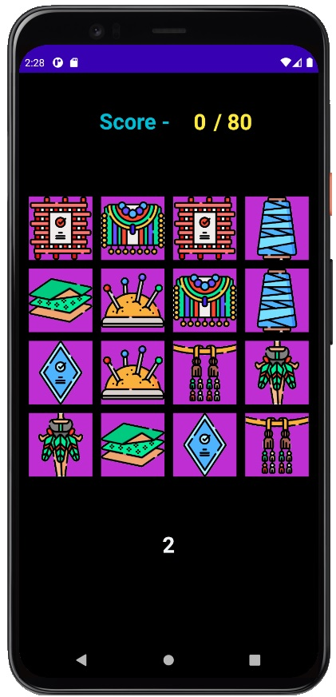
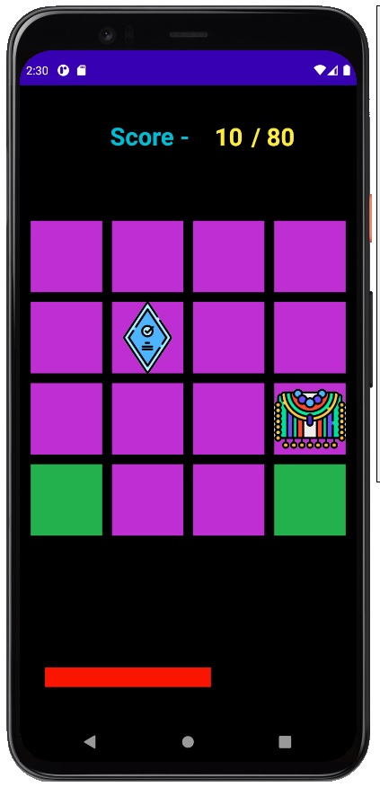

# Card-Game-App
### This app is created to test your memory power by showing some pairs of card for a very less time and pairing them as fast as you can  

## App Working
-------
| Showing Time        |   Matching Cards             | 
| ------------- | ---------:|
|      | |

## About the App
The cards are shown for 3 seconds and then the game starts  
The Progress bar is set for 30 seconds and the player has to  
match the pair as fast as possible   
10 points are given for every correct pair choosen  
and those pair then indicate that it is correct by showing green area
